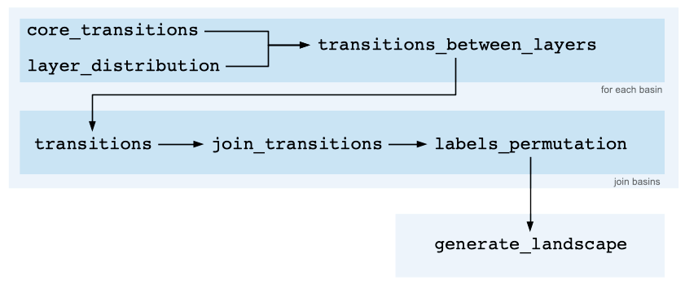

**AttAttach** is a python library for generating the attractor landscape of a Boolean network with given number and types of attractors.

The attractor landscape of the deterministic dynamics of a Boolean network with $n$ dynamic nodes possesses the folowing properties:
1) It is a directed graph with $2^n$ nodes (global states of the Boolean network);
2) The out degree of each of its nodes is equal to 1.

Therefore, it constitutes of a finite number of disconnet components. Each component constitutes of a single cycle (a fixed-point when the length of the cycle is equal to 1) to which a certain number of *branches* (subnetworks with a three topology) are attached. 

**AttAttch** generates this landscape for a specified number of cycles of given lengths.

