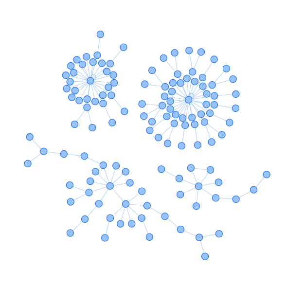
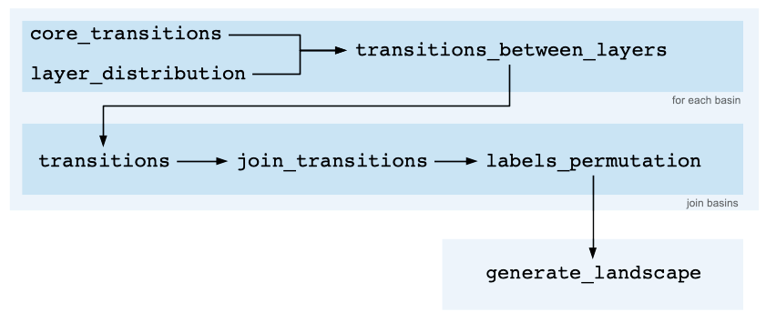

# **AttAttach**

**AttAttach** is a Python library for generating the attractor landscape of a Boolean network with a given number and types of attractors.

The attractor landscape of the deterministic dynamics of a Boolean network with $N$ dynamic nodes possesses the following properties:

1) It is a directed graph with $2^N$ nodes (global states of the Boolean network);
2) The out-degree of each node is equal to 1.

Therefore, it is the union of a finite number of disconnected components. Each component consists of a single cycle (a fixed-point when the length of the cycle is equal to 1) with a certain number of converging branches (subnetworks with a tree topology) attached to it.
**AttAttach** generates this landscape for a specified number of cycles of given lengths and assigned relative sizes of the basins of attraction.



For each basin, **AttAttach** first generates the transitions within the cycle. It then selects a random number of nodes in the basin (according to a uniform distribution) that will directly transition to the cycle. It progressively populates outer shells of nodes until all nodes in the basin are included.

Note that, even if the number of nodes in a layer is determined using a uniform distribution between 1 and the number of nodes still available, this algorithm favors layer distributions where layers closer to the cycle are more densely populated. Changing this bias requires modifying the **'layer_distribution'** function.

This process is repeated for each basin. The disconnected components are then joined, and the final labels are permuted. This also means that these transitions can happen between states at arbitrary Hamming distance. If this is an unwanted feature, then the **'labels_permutation'** function needs to be modified accordingly.




# Update Oct 19, 2023

The output of **'generate_landscape'** is no longer randomized.
The labels are no longer shuffled, so that states with lower labels are closer to the attracors.
The randomization is performed a posteriori by appliying **'random_labels_permutation'** to the output of 
**'generate_landscape'**.

For the same topology of the transition graph it is now possible to generate transitions at small Hamming sistance by using the new function 
**'smallH_labels_permutation'** instead of **'random_labels_permutation'**. The new output is Hmax, sorted_transitions.

Need to update documentation and picture. Add documentation for **'generate_edges_maximum_H(n, Hmax)'**, has it has its own usefulness.


**Related Repositories:**
* https://github.com/EnricoBorriello/Witness-Set

# Installation

To install the package and its python dependencies using pip, clone the repository, descend into the `AttAttach/` folder, and run

```
pip install -e .
```
